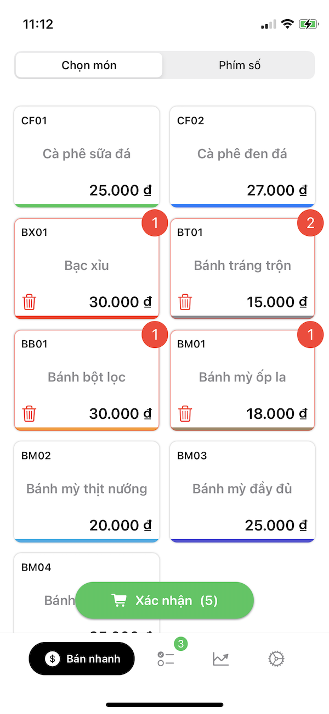

# HandyPOS

 Screenshots 

## Tổng quan/Overview
Dự án xây dựng giải pháp POS trên điện thoại cho các xe bán hàng nhỏ bán đồ ăn sáng.
Hoạt động offline nên có thể cơ động ở bất kỳ đâu.

The project aims to build a POS solution on smartphones for small food vending trucks. 
It operates offline and can be used flexibly anywhere.

## Chức năng/Features 
- Xây dưng menu và gọi món / Building menu and ordering
- Thống kê doanh thu và lợi nhuận / Revenue and profit statistics
- In hoá đơn và chia sẻ / Bill printing and sharing

### Hoàn thành/Completed
Phần gọi món, quản lý đơn hàng đã hoàn thành
Có thể xuất hoá đơn dạng hình ảnh và lưu vào album
Một số thông kê cơ bản trong tuần và tháng

The ordering and order management has been completed.
Invoices can be exported in the form of an image and saved to an album.
Basic statistics for the week and month are available.

### Mục tiêu/Todo
- Có thể kết nối máy in và in hoá đơn trực tiếp / Can connect to a printer and print invoices directly
- Xuất ra file excel cho các đơn hàng đã tạo / Export order to excel file for order that was created

## Các thư viện sử dụng/Library
- SwiftUI và Combine
- RealmDB
- Clean Architecture

https://apps.apple.com/us/app/hpos-quản-lý-bán-hàng/id1617422347
